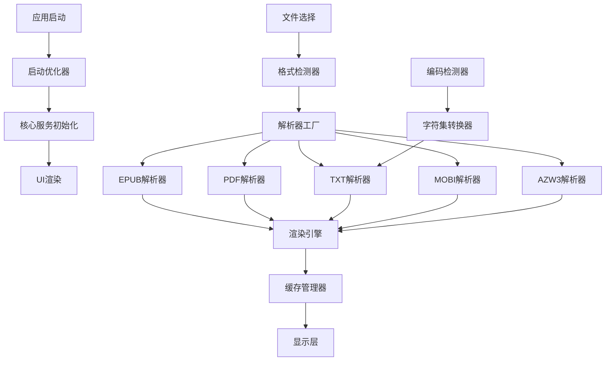

# 设计文档

## 概述

本设计文档描述了PureReader电子书阅读器的性能优化和多格式支持功能的技术实现方案。主要目标是将应用启动时间优化到0.5秒内，并支持EPUB、PDF、TXT、MOBI、AZW3等多种电子书格式，同时处理多种文本编码格式。

## 架构

### 整体架构设计



### 分层架构

1. **启动优化层**: 负责应用快速启动和资源延迟加载
2. **格式检测层**: 智能识别文件格式和编码
3. **解析器层**: 各种格式的专用解析器
4. **渲染引擎层**: 统一的内容渲染和显示
5. **缓存管理层**: 智能缓存和内存管理
6. **UI交互层**: 用户界面和交互逻辑

## 组件和接口

### 1. 启动优化组件

#### StartupOptimizer
```dart
class StartupOptimizer {
  static Future<void> initialize() async {
    // 并行初始化核心服务
    await Future.wait([
      _initializeEssentialServices(),
      _preloadCriticalResources(),
      _setupPerformanceMonitoring(),
    ]);
  }
  
  static Future<void> _initializeEssentialServices() async {
    // 只初始化启动必需的服务
  }
  
  static void _deferNonCriticalInitialization() {
    // 延迟初始化非关键服务
  }
}
```

#### LazyServiceLoader
```dart
class LazyServiceLoader {
  static final Map<Type, dynamic> _services = {};
  
  static T getService<T>() {
    if (!_services.containsKey(T)) {
      _services[T] = _createService<T>();
    }
    return _services[T] as T;
  }
}
```

### 2. 格式检测组件

#### FileFormatDetector
```dart
class FileFormatDetector {
  static Future<EbookFormat> detectFormat(String filePath) async {
    // 1. 检查文件扩展名
    final extension = path.extension(filePath).toLowerCase();
    
    // 2. 检查文件头信息
    final bytes = await File(filePath).openRead(0, 1024).first;
    
    // 3. 返回检测到的格式
    return _analyzeFileSignature(bytes, extension);
  }
  
  static EbookFormat _analyzeFileSignature(List<int> bytes, String extension) {
    // 实现文件头分析逻辑
  }
}
```

#### EncodingDetector
```dart
class EncodingDetector {
  static Future<Encoding> detectEncoding(List<int> bytes) async {
    // 1. 检查BOM标记
    if (_hasBOM(bytes)) {
      return _getBOMEncoding(bytes);
    }
    
    // 2. 统计字符频率分析
    final stats = _analyzeCharacterFrequency(bytes);
    
    // 3. 返回最可能的编码
    return _determineMostLikelyEncoding(stats);
  }
}
```

### 3. 解析器工厂

#### EbookParserFactory
```dart
abstract class EbookParser {
  Future<EbookContent> parse(String filePath);
  Stream<double> get progressStream;
}

class EbookParserFactory {
  static EbookParser createParser(EbookFormat format) {
    switch (format) {
      case EbookFormat.epub:
        return EpubParser();
      case EbookFormat.pdf:
        return PdfParser();
      case EbookFormat.txt:
        return TxtParser();
      case EbookFormat.mobi:
        return MobiParser();
      case EbookFormat.azw3:
        return Azw3Parser();
      default:
        throw UnsupportedFormatException(format);
    }
  }
}
```

### 4. 具体解析器实现

#### EpubParser (现有优化)
```dart
class EpubParser implements EbookParser {
  @override
  Future<EbookContent> parse(String filePath) async {
    // 使用现有的epub_view库，但添加渐进式加载
    final controller = EpubController(
      document: EpubDocument.openFile(File(filePath)),
    );
    
    return EbookContent(
      controller: controller,
      format: EbookFormat.epub,
    );
  }
}
```

#### PdfParser
```dart
class PdfParser implements EbookParser {
  @override
  Future<EbookContent> parse(String filePath) async {
    // 使用pdf库解析PDF文件
    final document = await PdfDocument.openFile(filePath);
    
    return EbookContent(
      document: document,
      format: EbookFormat.pdf,
      pageCount: document.pagesCount,
    );
  }
}
```

#### TxtParser
```dart
class TxtParser implements EbookParser {
  @override
  Future<EbookContent> parse(String filePath) async {
    // 1. 检测编码
    final bytes = await File(filePath).readAsBytes();
    final encoding = await EncodingDetector.detectEncoding(bytes);
    
    // 2. 解码文本
    final content = encoding.decode(bytes);
    
    // 3. 分页处理
    final pages = _splitIntoPages(content);
    
    return EbookContent(
      textContent: content,
      pages: pages,
      format: EbookFormat.txt,
    );
  }
}
```

#### MobiParser
```dart
class MobiParser implements EbookParser {
  @override
  Future<EbookContent> parse(String filePath) async {
    // 实现MOBI格式解析
    final mobiFile = await MobiFile.open(filePath);
    final content = await mobiFile.extractContent();
    
    return EbookContent(
      htmlContent: content,
      format: EbookFormat.mobi,
    );
  }
}
```

### 5. 渲染引擎

#### UnifiedRenderEngine
```dart
class UnifiedRenderEngine {
  Widget buildReader(EbookContent content, ReaderConfig config) {
    switch (content.format) {
      case EbookFormat.epub:
        return _buildEpubReader(content, config);
      case EbookFormat.pdf:
        return _buildPdfReader(content, config);
      case EbookFormat.txt:
        return _buildTextReader(content, config);
      case EbookFormat.mobi:
      case EbookFormat.azw3:
        return _buildHtmlReader(content, config);
    }
  }
  
  Widget _buildTextReader(EbookContent content, ReaderConfig config) {
    return PageView.builder(
      itemCount: content.pages.length,
      itemBuilder: (context, index) {
        return Container(
          padding: EdgeInsets.all(config.padding),
          child: Text(
            content.pages[index],
            style: TextStyle(
              fontSize: config.fontSize,
              height: config.lineHeight,
              color: config.textColor,
            ),
          ),
        );
      },
    );
  }
}
```

### 6. 缓存管理器

#### CacheManager
```dart
class CacheManager {
  static const int maxCacheSize = 100 * 1024 * 1024; // 100MB
  static final LRUCache<String, EbookContent> _cache = LRUCache(maxCacheSize);
  
  static Future<EbookContent?> getCachedContent(String filePath) async {
    final key = _generateCacheKey(filePath);
    return _cache.get(key);
  }
  
  static Future<void> cacheContent(String filePath, EbookContent content) async {
    final key = _generateCacheKey(filePath);
    _cache.put(key, content);
  }
  
  static void clearCache() {
    _cache.clear();
  }
}
```

## 数据模型

### EbookFormat枚举
```dart
enum EbookFormat {
  epub,
  pdf,
  txt,
  mobi,
  azw3,
  unknown,
}
```

### EbookContent模型
```dart
class EbookContent {
  final EbookFormat format;
  final String? textContent;
  final List<String>? pages;
  final String? htmlContent;
  final dynamic controller; // EpubController, PdfDocument等
  final int? pageCount;
  final Map<String, dynamic>? metadata;
  
  EbookContent({
    required this.format,
    this.textContent,
    this.pages,
    this.htmlContent,
    this.controller,
    this.pageCount,
    this.metadata,
  });
}
```

### PerformanceMetrics模型
```dart
class PerformanceMetrics {
  final DateTime startTime;
  final DateTime? uiReadyTime;
  final DateTime? contentLoadedTime;
  final int memoryUsage;
  final double cpuUsage;
  
  Duration get startupTime => uiReadyTime?.difference(startTime) ?? Duration.zero;
  Duration get loadTime => contentLoadedTime?.difference(startTime) ?? Duration.zero;
}
```

## 正确性属性

*属性是一个特征或行为，应该在系统的所有有效执行中保持为真——本质上是关于系统应该做什么的正式声明。属性作为人类可读规范和机器可验证正确性保证之间的桥梁。*

### 属性 1: 启动性能保证
*对于任何* 应用启动场景，从启动开始到主界面显示的时间应该小于500毫秒
**验证: 需求 1.1, 1.2**

### 属性 2: 交互响应性保证
*对于任何* 用户交互操作，系统应该在200毫秒内提供视觉反馈或响应
**验证: 需求 1.3**

### 属性 3: 书籍恢复性能
*对于任何* 最近阅读的书籍，打开到上次阅读位置的时间应该小于500毫秒
**验证: 需求 1.4**

### 属性 4: UI非阻塞加载
*对于任何* 大型文件加载操作，UI应该保持响应状态而不被阻塞
**验证: 需求 1.5**

### 属性 5: 多格式文件支持
*对于任何* 支持的电子书格式（EPUB、PDF、TXT、MOBI、AZW3），系统应该能够正确解析并显示内容
**验证: 需求 2.1, 2.2, 2.3, 2.4, 2.5**

### 属性 6: 错误处理友好性
*对于任何* 不支持或损坏的文件，系统应该显示友好的错误信息而不是崩溃
**验证: 需求 2.6, 5.5**

### 属性 7: 多编码字符正确显示
*对于任何* 支持的文本编码格式（UTF-8、GBK、Big5、ISO-8859-1），系统应该正确显示所有字符
**验证: 需求 3.1, 3.2, 3.3, 3.4**

### 属性 8: 编码自动检测
*对于任何* 无明确编码标识的文本文件，系统应该尝试自动检测并使用最合适的编码
**验证: 需求 3.5**

### 属性 9: 编码错误恢复
*对于任何* 编码检测失败的情况，系统应该提供用户选择编码的选项
**验证: 需求 3.6**

### 属性 10: 大文件分页加载
*对于任何* 大于50MB的电子书文件，系统应该使用分页加载策略而不是一次性加载全部内容
**验证: 需求 4.1**

### 属性 11: 智能预加载
*对于任何* 翻页操作，系统应该预加载相邻页面以提供流畅的阅读体验
**验证: 需求 4.2**

### 属性 12: 内存管理
*对于任何* 内存使用超过阈值的情况，系统应该自动释放未使用的缓存以防止内存溢出
**验证: 需求 4.3**

### 属性 13: 资源清理
*对于任何* 书籍切换操作，系统应该正确清理前一本书的所有资源
**验证: 需求 4.4**

### 属性 14: 图片优化处理
*对于任何* 包含大量图片的电子书，系统应该使用压缩和懒加载技术优化性能
**验证: 需求 4.5**

### 属性 15: 智能格式检测
*对于任何* 电子书文件，系统应该能够通过扩展名和文件头信息正确识别其真实格式
**验证: 需求 5.1, 5.2, 5.3**

### 属性 16: 未知格式降级处理
*对于任何* 无法识别格式的文件，系统应该尝试作为纯文本处理而不是拒绝打开
**验证: 需求 5.4**

### 属性 17: 即时内容显示
*对于任何* 电子书打开操作，系统应该立即显示第一页内容而不等待全部内容加载完成
**验证: 需求 6.1**

### 属性 18: 异步后台处理
*对于任何* 内容加载操作，系统应该在后台异步处理而不阻塞用户界面
**验证: 需求 6.2**

### 属性 19: 跳转快速响应
*对于任何* 章节跳转操作，系统应该显示加载指示器并快速加载目标内容
**验证: 需求 6.3**

### 属性 20: 智能缓存管理
*对于任何* 解析完成的内容，系统应该缓存结果并在重新打开时优先使用缓存，当缓存空间不足时使用LRU策略清理
**验证: 需求 6.4, 6.5, 6.6**

## 错误处理

### 错误类型和处理策略

1. **文件访问错误**
   - 文件不存在或无权限访问
   - 处理: 显示友好错误信息，建议用户检查文件路径和权限

2. **格式解析错误**
   - 文件格式损坏或不支持
   - 处理: 尝试降级处理，如作为纯文本打开，或显示具体错误信息

3. **编码错误**
   - 字符编码检测失败或解码错误
   - 处理: 提供编码选择界面，让用户手动选择正确编码

4. **内存不足错误**
   - 大文件导致内存溢出
   - 处理: 自动启用分页加载，清理缓存，降低图片质量

5. **网络相关错误**
   - 在线资源加载失败
   - 处理: 提供离线模式，缓存关键资源

### 错误恢复机制

```dart
class ErrorRecoveryManager {
  static Future<void> handleError(Exception error, String context) async {
    switch (error.runtimeType) {
      case FileSystemException:
        await _handleFileError(error as FileSystemException, context);
        break;
      case FormatException:
        await _handleFormatError(error as FormatException, context);
        break;
      case OutOfMemoryError:
        await _handleMemoryError(context);
        break;
      default:
        await _handleGenericError(error, context);
    }
  }
}
```

## 测试策略

### 双重测试方法

本项目采用单元测试和基于属性的测试相结合的方法：

- **单元测试**: 验证特定示例、边界情况和错误条件
- **基于属性的测试**: 验证所有输入的通用属性
- 两者互补，提供全面覆盖

### 单元测试重点

单元测试专注于：
- 特定示例，展示正确行为
- 组件间集成点
- 边界情况和错误条件

基于属性的测试专注于：
- 通过随机化实现全面输入覆盖的通用属性

### 基于属性的测试配置

- 使用Flutter的test包结合faker包进行属性测试
- 每个属性测试最少运行100次迭代（由于随机化）
- 每个属性测试必须引用其设计文档属性
- 标签格式: **功能: ebook-performance-optimization, 属性 {编号}: {属性文本}**

### 测试库选择

- **单元测试**: Flutter test框架
- **基于属性的测试**: test + faker包组合
- **性能测试**: Flutter Driver + 自定义性能监控
- **集成测试**: Flutter集成测试框架

### 测试数据生成

```dart
class TestDataGenerator {
  static List<int> generateRandomBytes(int length) {
    final random = Random();
    return List.generate(length, (_) => random.nextInt(256));
  }
  
  static String generateTextWithEncoding(Encoding encoding, int length) {
    // 生成指定编码的测试文本
  }
  
  static File generateTestEbook(EbookFormat format, int sizeInMB) {
    // 生成指定格式和大小的测试电子书
  }
}
```

### 性能测试框架

```dart
class PerformanceTestFramework {
  static Future<Duration> measureStartupTime() async {
    final stopwatch = Stopwatch()..start();
    // 执行启动流程
    await StartupOptimizer.initialize();
    stopwatch.stop();
    return stopwatch.elapsed;
  }
  
  static Future<bool> testUIResponsiveness() async {
    // 测试UI响应性
    return true; // 实现具体测试逻辑
  }
}
```